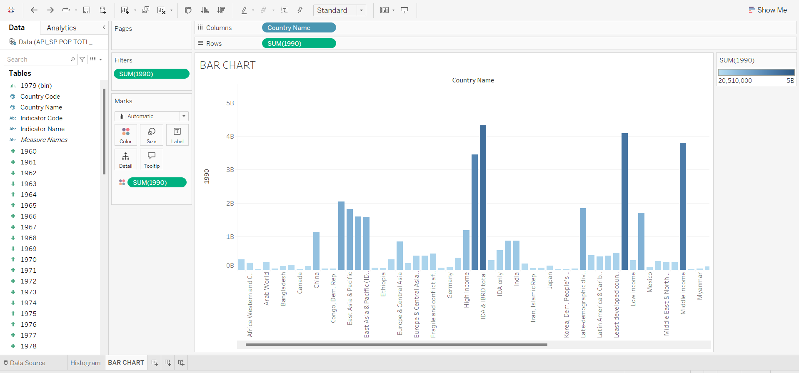
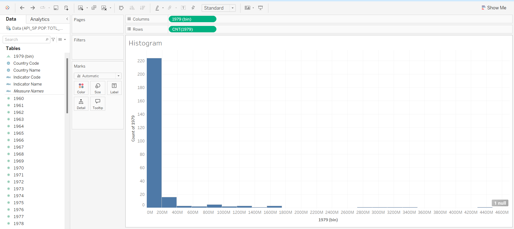

# Population Demographics Visualization Project

## Project Overview

This project visualizes the distribution of population data across different countries and regions by creating bar charts and histograms. The purpose is to analyze the population composition and identify trends in different age groups, income levels, and regions.

## Visualizations

### 1. Population Distribution Bar Chart
This bar chart displays the total population by country for the year 1990, giving an overview of population size across different regions.



### 2. Population Histogram
The histogram shows the frequency distribution of population counts for the year 1979. It helps visualize the distribution of population sizes, allowing for insights into how populations are spread across various sizes.



## Goals

- **Explore Population Trends**: Analyze population size across countries and regions.
- **Identify Distribution Patterns**: Observe the spread of population sizes and detect clustering in different population ranges.
- **Visualize Global Demographics**: Use data visualizations to highlight the global population composition.

## Features

- **Bar Chart**: Displays population data by country to highlight population distribution.
- **Histogram**: Shows frequency of population sizes for different bins, emphasizing the distribution across sizes.

## Technologies Used

- **Data Source**: Population data from the World Bank or a similar reliable demographic dataset.
- **Visualization Tool**: Tableau, used to create both the bar chart and histogram.

## Getting Started

1. **Clone the Repository**:
   ```bash
   git clone https://github.com/Deepak0769/PRODIGY_DS_01.git
